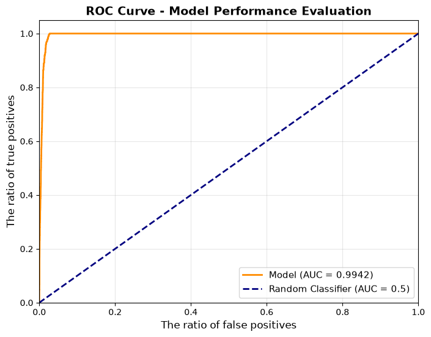
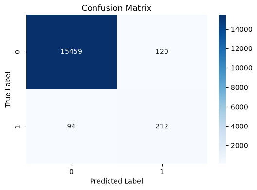
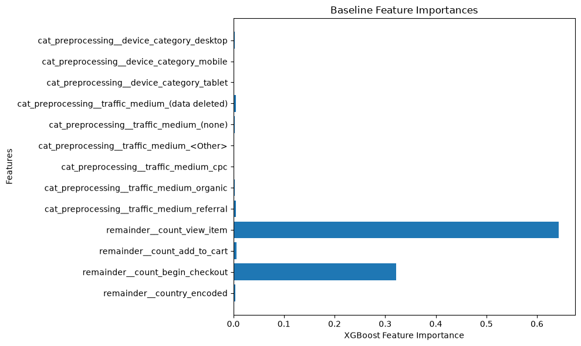

<div align="center">

# E-commerce Conversion Prediction

### Predicting purchase intent from Google Analytics 4 user behaviour

An end-to-end machine learning project that transforms e-commerce activity data into a trained XGBoost classification pipeline and exposes its predictions through an interactive Streamlit dashboard.

<p>
  <a href="https://www.python.org/"></a>
  <a href="https://streamlit.io/"></a>
  <a href="https://cloud.google.com/bigquery"></a>
  <a href="https://github.com/dmlc/xgboost"></a>
</p>

<p>
  <a href="https://bqecommerceproject-up6hblseqvj8tggchxdfjt.streamlit.app/"><strong>Open the live Streamlit application</strong></a>
</p>

</div>

---

## Current architecture: monolithic version

This repository contains the **monolithic version** of the project. In this version, the trained machine learning pipeline is stored directly in the Streamlit project and loaded by `app.py` at runtime. The user interface and the inference logic therefore run together in the same application.

This architecture is intentionally simple and suitable for demonstrating the complete workflow in one deployable Streamlit application:

```text
User
  |
  v
Streamlit interface
  |
  v
Local XGBoost pipeline (.pkl)
  |
  v
Purchase prediction
```

The current version does **not** include a FastAPI service, a separate backend, or Docker containerisation.

## Separate API-based version

A second, separate project is dedicated to evolving this solution into a service-oriented architecture. That project covers the API and containerisation layer needed to expose the model as a backend.

In that architecture, the Streamlit application will act as the frontend and call a FastAPI service for inference:

```text
User
  |
  v
Streamlit frontend
  |
  | HTTP request
  v
FastAPI backend
  |
  v
Model inference
```

FastAPI, Docker, and the API-to-Streamlit integration belong to that separate project and are not part of the implementation documented in this repository.

---

## Project overview

This project studies user behaviour in an e-commerce funnel and predicts whether a user is likely to complete a purchase.

The work is organised into two complementary parts:

1. **Analysis and training** — the notebook queries the public Google Analytics 4 sample e-commerce dataset, aggregates event-level activity at user level, explores conversion behaviour, trains and evaluates an XGBoost model, and exports the fitted pipeline.
2. **Interactive inference** — the Streamlit application loads the exported pipeline and lets a user simulate a session before requesting a purchase prediction and probability.

The repository contains the trained artefacts and a local CSV export, so the dashboard itself performs inference from the saved model. It does not query BigQuery when the app is running.

## What the application does

The dashboard provides controls for:

- Number of products viewed
- Number of products added to cart
- Number of checkout attempts
- Device category: desktop, mobile, or tablet
- Traffic medium: organic, cpc, referral, or none
- Country from the country list used by the application

When the prediction button is pressed, the app:

- Builds a one-row pandas DataFrame with the same feature names expected by the model
- Calls the serialized pipeline to predict the class
- Displays the predicted outcome and the model's probability of purchase
- Shows the current session metrics in a compact dashboard layout

## Data and machine learning workflow

The notebook builds a user-level dataset from the public table
`bigquery-public-data.ga4_obfuscated_sample_ecommerce.events_*`.

The engineered dataset contains **79,421 user records and 8 columns**, including:

- `device_category`
- `country`
- `traffic_medium`
- `count_view_item`
- `count_add_to_cart`
- `count_begin_checkout`
- `target_has_purchased`

For modelling, the notebook derives `country_encoded`, prepares categorical and numerical features in a scikit-learn pipeline, and trains an `XGBClassifier`. The resulting pipeline is saved as `xgboost_ecommerce_pipeline.pkl`, which is loaded by `app.py` with `joblib`.

### Evaluation snapshot

The notebook reports the following test-set classification results:

```text
              precision    recall  f1-score   support

           0       0.99      0.99      0.99     15579
           1       0.64      0.69      0.66       306

    accuracy                           0.99     15885
   macro avg       0.82      0.84      0.83     15885
weighted avg       0.99      0.99      0.99     15885
```

The dataset is strongly imbalanced: non-purchasing users substantially outnumber purchasing users. For that reason, accuracy should not be considered in isolation; the precision, recall, F1-score for class `1`, and ROC-AUC provide a more informative view of buyer detection.

The notebook reports a best cross-validation ROC-AUC of **0.9944** and a test ROC-AUC of approximately **0.9942** for the trained pipeline. These figures describe the experiments recorded in the notebook and are not a guarantee for new production data.

## Model visualizations

The repository includes the main visual outputs generated during model evaluation and interpretation.

### ROC curve



### Confusion matrix



### Feature importance



## Technology stack

The implementation uses:

- **Python** for data preparation, analysis, and inference
- **Pandas and NumPy** for tabular data manipulation
- **Google Cloud BigQuery** in the notebook for querying the public GA4 sample dataset
- **scikit-learn** for preprocessing, pipelines, model selection, and evaluation
- **XGBoost** for binary classification
- **Joblib** for saving and loading the trained pipeline
- **Matplotlib and Seaborn** for exploratory analysis and evaluation plots
- **Streamlit** for the interactive prediction dashboard
- **Jupyter Notebook** for the analysis and training workflow

## Repository structure

```text
bq_ecommerce_project/
├── app.py                              # Streamlit prediction dashboard
├── xgboost_ecommerce_pipeline.pkl      # Trained XGBoost/scikit-learn pipeline
├── requirements.txt                    # Python dependencies
├── data/
│   └── ecommerce_users_raw.csv         # Local user-level data export
├── notebooks/
│   ├── ecommerce_analysis.ipynb        # Data analysis, training, and evaluation
│   ├── ecommerce_users_raw.csv         # Notebook data copy
│   ├── xgboost_ecommerce_pipeline.pkl  # Notebook model artefact
│   ├── config.py                       # Local BigQuery credential configuration
│   └── .gitignore
└── src/
    ├── load_data.py                    # CSV loading helper
    ├── ROC.png                         # ROC curve
    ├── Confusion_Matrix.png            # Confusion matrix
    └── output.png                      # Feature importance plot
```

## Installation

### Requirements

- Python 3.9 or newer
- `pip`
- Google Cloud credentials configured locally only if you want to rerun the BigQuery sections of the notebook

The Streamlit dashboard uses the local model file and does not require BigQuery credentials.

### Setup

From the project root:

```bash
python -m venv .venv
```

Activate the virtual environment:

```bash
# macOS / Linux
source .venv/bin/activate

# Windows PowerShell
.venv\Scripts\Activate.ps1
```

Install the project dependencies:

```bash
python -m pip install --upgrade pip
pip install -r requirements.txt
```

## Run the Streamlit application

Make sure `xgboost_ecommerce_pipeline.pkl` is in the project root, then run:

```bash
streamlit run app.py
```

Streamlit will display a local URL in the terminal, usually:

```text
http://localhost:8501
```

Open that URL in a browser, adjust the session inputs in the sidebar, and select **Predict Conversion Likelihood**.

## Run the analysis notebook

To reproduce the data preparation, exploratory analysis, model training, and evaluation:

```bash
jupyter notebook notebooks/ecommerce_analysis.ipynb
```

The BigQuery cells require valid Google Cloud authentication and access to the public GA4 dataset. Credentials are not included in this repository. The notebook can also be used to inspect the saved local data and the modelling steps without changing the Streamlit application.

## Important notes

- The dashboard is an inference interface, not a data collection or model retraining service.
- Predictions are based on the feature ranges and country choices exposed in the current Streamlit interface.
- The evaluation results come from the experiment stored in the notebook and should be reassessed before using the model with a different population or business context.

## License

No license file is currently included in this repository.
